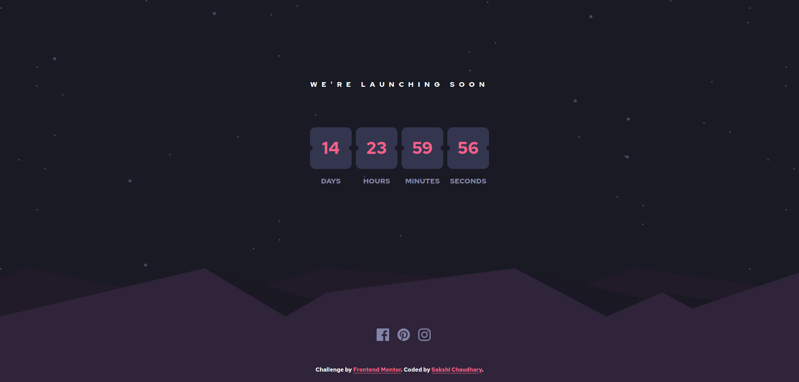

# Frontend Mentor - Launch countdown timer solution

This is a solution to the [Launch countdown timer challenge on Frontend Mentor](https://www.frontendmentor.io/challenges/launch-countdown-timer-N0XkGfyz-). Frontend Mentor challenges help you improve your coding skills by building realistic projects.

## Table of contents

- [Overview](#overview)
  - [The challenge](#the-challenge)
  - [Screenshot](#screenshot)
  - [Links](#links)
- [My process](#my-process)
  - [Built with](#built-with)
  - [What I learned](#what-i-learned)
  - [Continued development](#continued-development)
  - [Useful resources](#useful-resources)
- [Author](#author)
- [Acknowledgments](#acknowledgments)

## Overview

### The challenge

Users should be able to:

- See hover states for all interactive elements on the page
- See a live countdown timer that ticks down every second (start the count at 14 days)
- **Bonus**: When a number changes, make the card flip from the middle

### Screenshot



### Links

- Solution URL: [Source Code](https://github.com/scjuly19/launch-countdown-timer-main.git)
- Live Site URL: [Live Website](https://compassionate-cori-632b72.netlify.app/)

## My process

I started by first structuring the html file and then moved on to add CSS in my index.css file.
To make it mobile compatible I didn't use any media queries instead just made use of flexbox wherever needed as I find it more convinient. To add the functionality of timer, I made use of VanillaJS.

### Built with

- Semantic HTML5 markup
- CSS custom properties
- Flexbox
- CSS Grid
- VanillaJs

### What I learned

While developing this challenge, I refreshed my knowledge about CSS flexbox and grid. I learned about CSS gradients and how to leverage svg images.

I added svg image with HTML tags instead of using them as background image in order to change the fill property on hover:

````html
<svg xmlns="http://www.w3.org/2000/svg" width="24" height="24">
  <path
    id="insta"
    fill="#8385A9"
    d="M12 2.163c3.204 0 3.584.012 4.85.07 3.252.148 4.771 1.691 4.919 4.919.058 1.265.069 1.645.069 4.849 0 3.205-.012 3.584-.069 4.849-.149 3.225-1.664 4.771-4.919 4.919-1.266.058-1.644.07-4.85.07-3.204 0-3.584-.012-4.849-.07-3.26-.149-4.771-1.699-4.919-4.92-.058-1.265-.07-1.644-.07-4.849 0-3.204.013-3.583.07-4.849.149-3.227 1.664-4.771 4.919-4.919 1.266-.057 1.645-.069 4.849-.069zM12 0C8.741 0 8.333.014 7.053.072 2.695.272.273 2.69.073 7.052.014 8.333 0 8.741 0 12c0 3.259.014 3.668.072 4.948.2 4.358 2.618 6.78 6.98 6.98C8.333 23.986 8.741 24 12 24c3.259 0 3.668-.014 4.948-.072 4.354-.2 6.782-2.618 6.979-6.98.059-1.28.073-1.689.073-4.948 0-3.259-.014-3.667-.072-4.947-.196-4.354-2.617-6.78-6.979-6.98C15.668.014 15.259 0 12 0zm0 5.838a6.162 6.162 0 100 12.324 6.162 6.162 0 000-12.324zM12 16a4 4 0 110-8 4 4 0 010 8zm6.406-11.845a1.44 1.44 0 100 2.881 1.44 1.44 0 000-2.881z"
  />
  </svg>
````

### Continued development

I want to explore CSS animations and transforms much more so that I could compelete the bonus challenge of flipping the card when the value changes. 


### Useful resources

- [Understand CSS-Flexbox and Grid](https://frontendmasters.com/courses/css-grids-flexbox/) - This helped me for understanding Grids and flexbox in a better and now they makes a lot more sense to me. I really liked this platform and will use it to learn some more concepts.


## Author

- Website - [Sakshi Chaudhary](https://www.linkedin.com/in/scjuly19)
- Frontend Mentor - [@scjuly19](https://www.frontendmentor.io/profile/scjuly19)
- Instagram- [@sakshi.codes](https://www.instagram.com/sakshi.codes)


